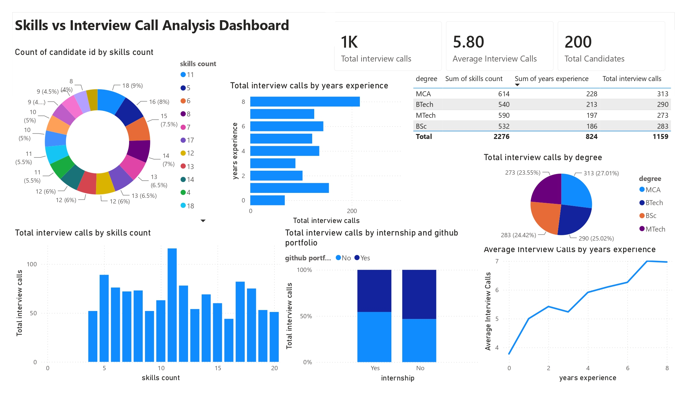

# 📊 Skills vs Interview Call Analysis Dashboard

A comprehensive **Power BI Dashboard** that analyzes the relationship between candidates' technical skills, educational background, work experience, internships, GitHub portfolios, and interview call outcomes. The dashboard provides actionable insights into the factors that influence interview opportunities and helps recruiters identify high-potential candidates.

---

## 📷 Dashboard Preview

---

# 📌 Project Overview

The **Skills vs Interview Call Analysis Dashboard** helps recruiters, hiring managers, and aspiring professionals understand how candidate profiles impact interview selection.

By analyzing skills, experience, education, internships, and GitHub portfolios, the dashboard identifies trends that influence interview call frequency and recruitment outcomes.

The dashboard enables users to:

- Analyze interview call distribution by skill count.
- Compare interview calls across experience levels.
- Evaluate the impact of internships and GitHub portfolios.
- Measure interview performance by degree.
- Understand how experience influences interview opportunities.

---

# 🎯 Business Problem

Recruiters receive hundreds of applications for every job opening, making it difficult to determine which candidate attributes contribute most to interview selection.

This dashboard answers key questions such as:

- Does having more technical skills increase interview calls?
- Which educational qualification performs best?
- How does work experience influence interview opportunities?
- Do internships and GitHub portfolios improve interview chances?
- What candidate profile is most likely to receive interview calls?

---

# 📂 Dataset

The dataset includes information such as:

- Candidate ID
- Skills Count
- Degree
- Years of Experience
- Internship Status
- GitHub Portfolio Availability
- Total Interview Calls
- Average Interview Calls

---

# 📈 Dashboard KPIs

| KPI | Value |
|------|--------|
| Total Interview Calls | **1K** |
| Average Interview Calls | **5.80** |
| Total Candidates | **200** |

---

# 📊 Dashboard Features

## 1. Candidate Distribution by Skills Count

Displays the distribution of candidates based on the number of technical skills they possess.

**Purpose**

- Understand the overall skills profile of the candidate pool.
- Identify the most common skill count among applicants.

---

## 2. Interview Calls by Years of Experience

Analyzes total interview calls across different experience levels.

**Purpose**

- Measure the relationship between professional experience and interview opportunities.
- Identify the most sought-after experience range.

---

## 3. Degree-wise Interview Summary

Interactive table displaying:

- Degree
- Total Skills Count
- Years of Experience
- Total Interview Calls

Degrees include:

- MCA
- B.Tech
- M.Tech
- B.Sc

**Purpose**

- Compare educational qualifications based on interview performance.

---

## 4. Interview Calls by Degree

Pie chart comparing interview calls received by candidates from different educational backgrounds.

**Purpose**

- Identify which qualifications receive the highest recruiter attention.

---

## 5. Interview Calls by Skills Count

Bar chart illustrating the relationship between the number of technical skills and total interview calls.

**Purpose**

- Evaluate whether a broader skill set increases interview opportunities.

---

## 6. Internship & GitHub Portfolio Analysis

Stacked column chart comparing interview calls based on:

- Internship Experience
- GitHub Portfolio Availability

**Purpose**

- Assess the impact of practical experience and project portfolios on recruitment outcomes.

---

## 7. Average Interview Calls by Experience

Line chart showing how average interview calls change as years of experience increase.

**Purpose**

- Understand interview trends throughout a candidate's career progression.

---

# 🛠 Tools Used

- Microsoft Power BI
- Power Query
- DAX
- Microsoft Excel
- Data Modeling

---

# 📌 Key Insights

- More than **1,000 interview calls** were analyzed across **200 candidates**.
- Candidates receive an average of **5.8 interview calls**.
- Candidates with a higher number of technical skills generally receive more interview opportunities.
- Interview calls increase consistently with years of professional experience.
- MCA and B.Tech graduates receive the highest number of interview calls among the analyzed degrees.
- Candidates with internship experience and GitHub portfolios demonstrate stronger interview performance.
- Practical experience and technical portfolios significantly enhance recruitment outcomes.

---

# 💼 Business Value

This dashboard helps organizations:

- Improve candidate screening strategies.
- Identify characteristics of high-performing applicants.
- Optimize recruitment decision-making.
- Evaluate the importance of technical skills and practical experience.
- Support data-driven hiring practices.
- Assist students and professionals in understanding factors that improve employability.

---

# 🚀 Future Enhancements

- AI-powered interview call prediction
- Resume quality and ATS score integration
- Technical skill gap analysis
- Certification impact on interview success
- Company-wise hiring trend analysis
- Interactive recruiter recommendation engine

---

# 📚 Skills Demonstrated

- Data Cleaning
- Data Modeling
- Power Query
- DAX Measures
- KPI Development
- Recruitment Analytics
- HR Analytics
- Dashboard Design
- Business Intelligence
- Data Visualization

---

# 👨‍💻 Author

**Yashwanth Katuru**

Aspiring Data Analyst | Power BI Developer

### Technical Skills

- Power BI
- SQL
- Excel
- Python
- Data Analytics
- HR Analytics
- Dashboard Development
